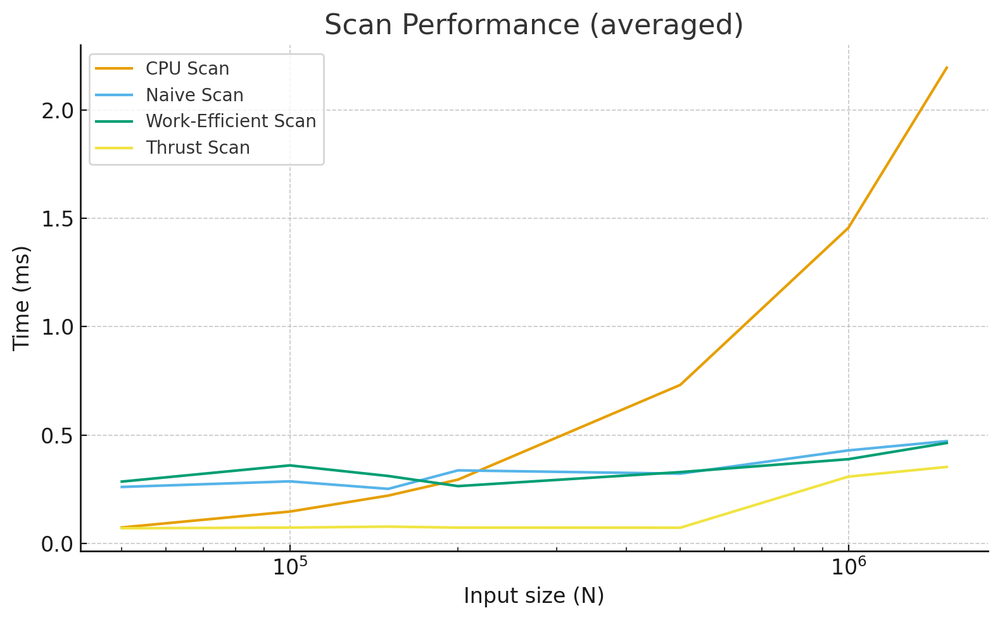
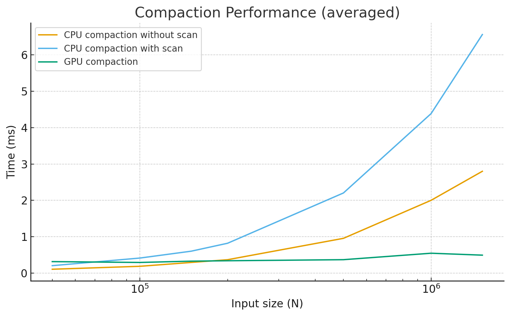

CUDA Stream Compaction
======================

**University of Pennsylvania, CIS 565: GPU Programming and Architecture, Project 2**

* Cecilia Chen 
  * [LinkedIn](https://www.linkedin.com/in/yue-chen-643182223/)
* Tested on: Windows 11, i7-13700F @ 2.1GHz 16GB, GeForce GTX 4070 12GB (Personal Computer)

---

### Project Overview
This project implements scan (exclusive prefix sum) and stream compaction five ways:
* CPU reference (exclusive scan; compaction with/without scan)
* Naive GPU scan
* Work-Efficient GPU scan (upsweep/downsweep, power-of-two padded) 
* GPU stream compaction (map → scan → scatter)
* Thrust exclusive_scan

Notes:
- Grid size was computed from `N` (and, for the work-efficient scan, from the active node count per level).   
- All implementations handle non-power-of-two sizes; the work-efficient scan pads to the next power of two internally.  

#### Optimization for Work-Efficient GPU Scan
During upsweep and downsweep, the number of **active nodes** halves each level. Sizing the grid **per level** reduces idle threads and improves efficiency.  
Specifically, per-level active nodes: **nodes(d) = n₂ >> (d + 1)**, where `n₂` is the padded power-of-two length and `d` is the tree level.

---

### Performance Plots

#### Timing policy
CPU timings use startCpuTimer()/endCpuTimer  
GPU timings use startGpuTimer()/endGpuTimer  
*exclude cudaMalloc/cudaMemcpy.   

#### Blocksize Optimization
To choose a block size per GPU implementation, I swept typical CUDA power-of-two thread counts and, for each candidate, ran **10 trials** and used the **average** runtime.

**Final choices:**  
Naive GPU scan: **512** threads per block  
Work-Efficient GPU scan: **256** threads per block  
GPU stream compaction: **256** threads per block  


**Repetitions:** For every **implementation × input size**, I ran 3 independent trials and report the **average**.

#### Scan


#### Compaction


### Performance Analysis

#### **Scan**

- Thrust is fastest at all sizes. Thrust < CPU at all tested sizes.
- Work-efficient vs Naive are close overall, with work-efficient pulling ahead from ~200k.
- CPU scan scales linearly and is best only at very small N (<~100k).

Why this happens:

Thrust uses highly optimized primitives with minimal kernel overhead and good memory access patterns, so it stays near the memory-bandwidth roofline even as N grows.  
Work-efficient scan does O(n) additions; Naive scan does O(n log n) reads/writes. At small N kernel overhead dominates; by ~200k, the fewer passes of work-efficient win.  
CPU is competitive at small N due to launch & transfer overheads you excluded from timing; as N grows, GPU bandwidth wins.

#### **Compaction**

- For small inputs (≤100k), CPU without scan is fastest.  
- Around N ≈ 200k, GPU compaction overtakes CPU without scan** and stays ahead thereafter.  
- At larger sizes the GPU advantage grows; GPU time remains relatively flat while CPU time scales roughly linearly.


Why this happens:

Compaction is memory-bound. Once kernel overhead is amortized, the GPU wins on bandwidth: a simple map pass, a work-efficient exclusive scan (upsweep/downsweep), and a scatter.  
CPU-with-scan performs extra work without the GPU’s bandwidth advantage, so it trails both GPU and CPU-no-scan.

---


### Test Program Output
*Data Size: 1>>15*

```text
****************
** SCAN TESTS **
****************
    [   8  15   3  48   4  20   5  47  37  18   2  49  38 ...  33   0 ]
==== cpu scan, power-of-two ====
   elapsed time: 0.0483ms    (std::chrono Measured)
    [   0   8  23  26  74  78  98 103 150 187 205 207 256 ... 798391 798424 ]
==== cpu scan, non-power-of-two ====
   elapsed time: 0.048ms    (std::chrono Measured)
    [   0   8  23  26  74  78  98 103 150 187 205 207 256 ... 798331 798375 ]
    passed
==== naive scan, power-of-two ====
   elapsed time: 0.2376ms    (CUDA Measured)
    passed
==== naive scan, non-power-of-two ====
   elapsed time: 0.15088ms    (CUDA Measured)
    passed
==== work-efficient scan, power-of-two ====
   elapsed time: 0.274432ms    (CUDA Measured)
    passed
==== work-efficient scan, non-power-of-two ====
   elapsed time: 0.146848ms    (CUDA Measured)
    passed
==== thrust scan, power-of-two ====
   elapsed time: 0.091136ms    (CUDA Measured)
    passed
==== thrust scan, non-power-of-two ====
   elapsed time: 0.026624ms    (CUDA Measured)
    passed

*****************************
** STREAM COMPACTION TESTS **
*****************************
    [   1   1   3   1   0   2   3   1   1   3   0   1   3 ...   2   0 ]
==== cpu compact without scan, power-of-two ====
   elapsed time: 0.0573ms    (std::chrono Measured)
    [   1   1   3   1   2   3   1   1   3   1   3   3   3 ...   1   2 ]
    passed
==== cpu compact without scan, non-power-of-two ====
   elapsed time: 0.057ms    (std::chrono Measured)
    [   1   1   3   1   2   3   1   1   3   1   3   3   3 ...   1   1 ]
    passed
==== cpu compact with scan ====
   elapsed time: 0.1607ms    (std::chrono Measured)
    [   1   1   3   1   2   3   1   1   3   1   3   3   3 ...   1   2 ]
    passed
==== work-efficient compact, power-of-two ====
   elapsed time: 0.271136ms    (CUDA Measured)
    passed
==== work-efficient compact, non-power-of-two ====
   elapsed time: 0.252608ms    (CUDA Measured)
    passed